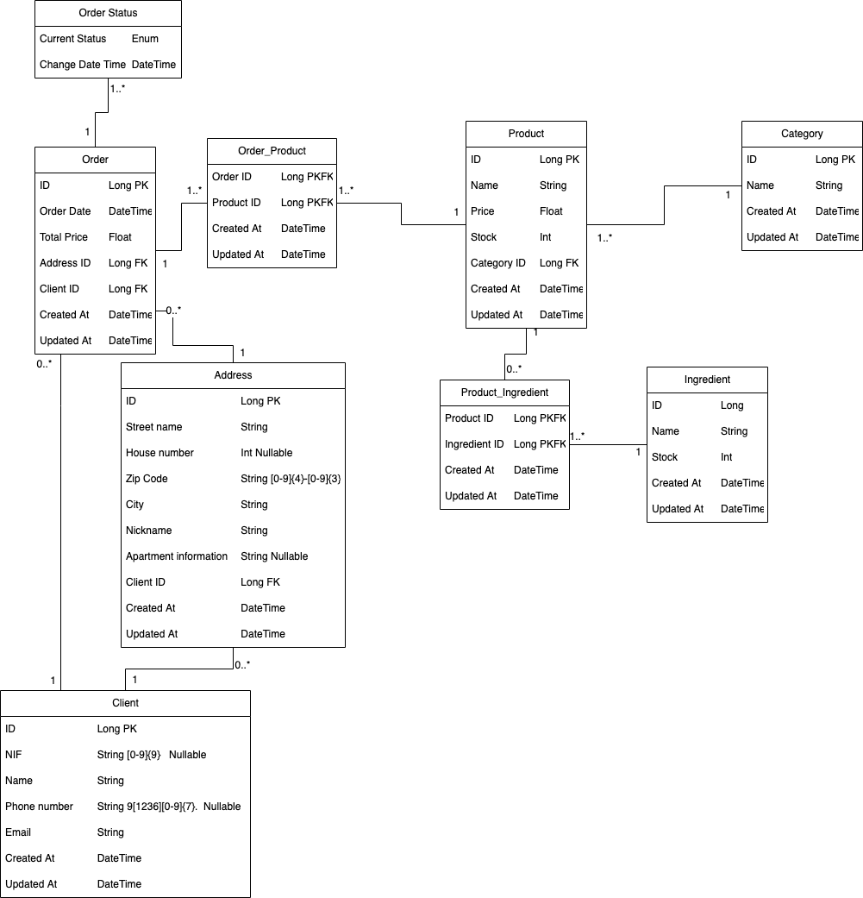

# Mindera Pizza

---
## Description

API that allows the management of orders from the restaurant *Pizza Mindera*.

---

## Technologies
- Java 17
- Spring Boot 2.7.2
- H2

---

## Data model

---

## Features

### Current:

### To Do v1.0:
- Receive a new order
- Accept an existing order
- Close an existing order
- Cancel an existing order
- Fetch all orders (usage of filter optional)
- Fetch a single order by ID

### To Do v2.0:
- CRUD Clients
- CRUD Addresses
- CRUD Ingredients
- CRUD Products
- CRUD Categories

---

## Endpoints

### Current:

### To Do v1.0:

- POST /api/order | Create an order
- POST /api/order/:id/status | Change an order's status
- GET /api/order with the possibility of adding RequestParameters ex: name, phone number, nif, status, etc | Fetch N orders
- GET /api/order/:id | Fetch a single order

### To Do v2.0:
- POST /api/client | Create a client
- GET /api/client | Fetch N clients
- GET /api/client/:id | Fetch a single client
- POST /api/client/:id/address | Create an address
- GET /api/client/:id/address | Fetch a client's N addresses
- POST /api/ingredient | Create a ingredient
- GET /api/ingredient | Fetch N ingredients
- POST /api/product | Create a product
- GET /api/product | Fetch N products
- POST /api/category | Create a category
- GET /api/category | Fetch N categories
